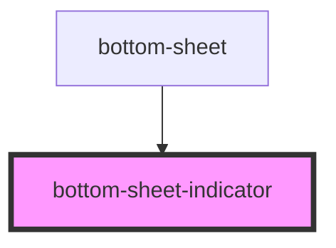

# bottom-sheet-indicator

<!-- Auto Generated Below -->

## Dependencies

### Used by

 - [bottom-sheet](../bottom-sheet)

### Graph

----------------------------------------------

*Built with [StencilJS](https://stenciljs.com/)*
