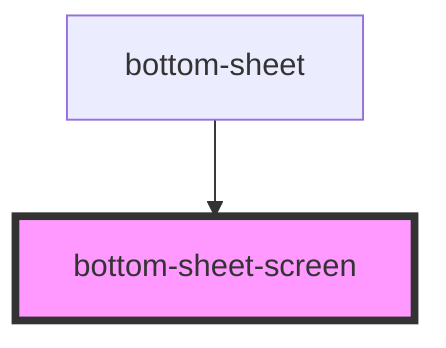

# bottom-sheet-screen

<!-- Auto Generated Below -->

## Properties

| Property   | Attribute  | Description | Type     | Default |
| ---------- | ---------- | ----------- | -------- | ------- |
| `progress` | `progress` |             | `number` | `0`     |

## Events

| Event              | Description | Type                |
| ------------------ | ----------- | ------------------- |
| `closeBottomSheet` |             | `CustomEvent<void>` |

## Methods

### `disable() => Promise<void>`

#### Returns

Type: `Promise<void>`

### `enable() => Promise<void>`

#### Returns

Type: `Promise<void>`

## Dependencies

### Used by

 - [bottom-sheet](../bottom-sheet)

### Graph

----------------------------------------------

*Built with [StencilJS](https://stenciljs.com/)*
