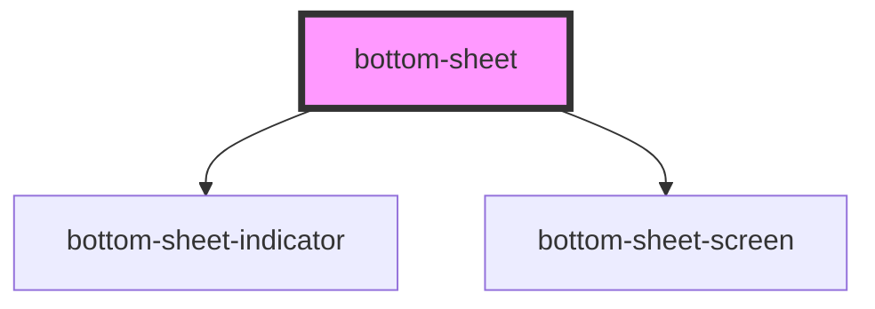

# bottom-sheet

<!-- Auto Generated Below -->

## Properties

| Property          | Attribute          | Description | Type                | Default    |
| ----------------- | ------------------ | ----------- | ------------------- | ---------- |
| `arrow`           | `arrow`            |             | `boolean`           | `false`    |
| `initialPosition` | `initial-position` |             | `"bottom" \| "top"` | `'bottom'` |

## Methods

### `close() => Promise<void>`

#### Returns

Type: `Promise<void>`

### `open() => Promise<void>`

#### Returns

Type: `Promise<void>`

## Dependencies

### Depends on

- [bottom-sheet-indicator](../bottom-sheet-indicator)
- [bottom-sheet-screen](../bottom-sheet-screen)

### Graph

----------------------------------------------

*Built with [StencilJS](https://stenciljs.com/)*
